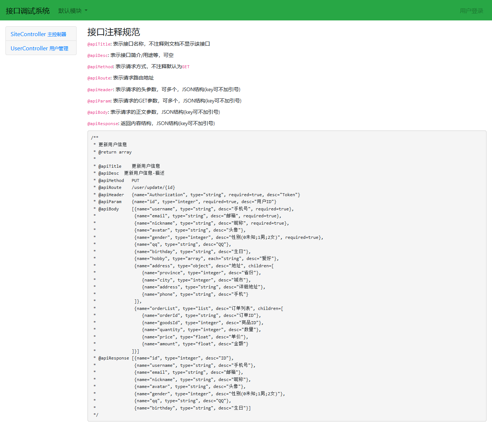
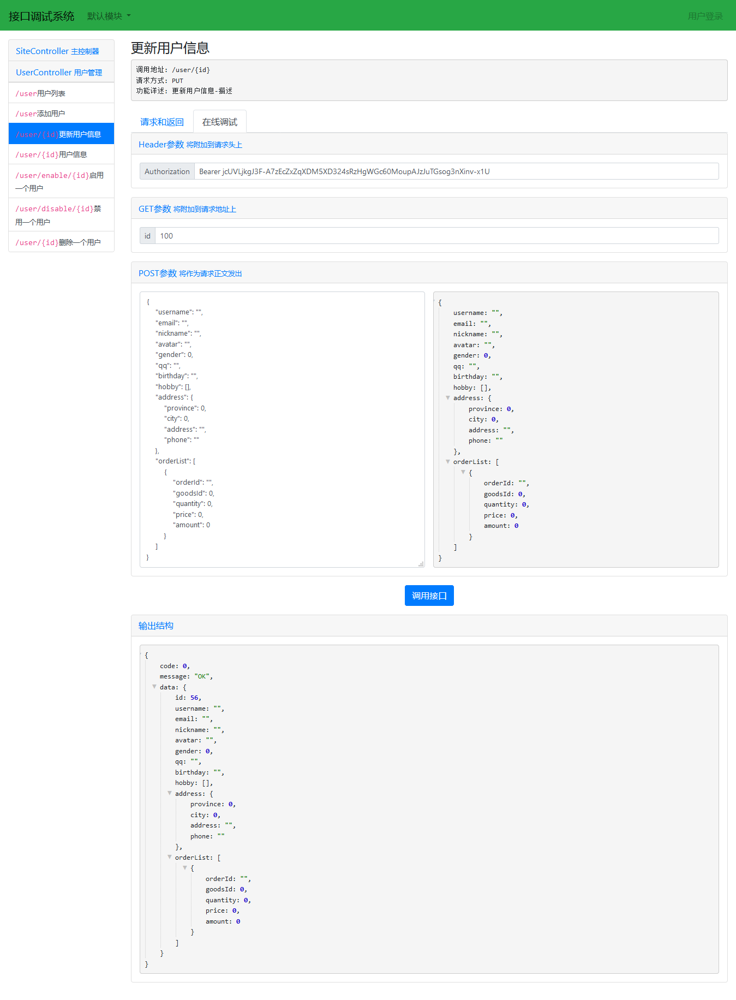

### 项目描述

    1、规范API接口的注释。注释即文档，注释结构不对无法渲染出页面，更无法与对接方交流。

    2、节省前后端文档定义和书写。文档按照基本格式输出，该有的元素都存在，极大的减少前后端交流成本。

    3、文档注释方便。配合phpstrom的自定制注释输出，不需要花费额外时间背文档特殊定义词汇。

安装:
------------
使用 [composer](http://getcomposer.org/download/) 下载:
```
composer require moxuandi/yii2-apidoc:"~1.0.0" --dev

# 开发版:
composer require moxuandi/yii2-apidoc:"dev-master" --dev
```

演示效果:
------------






使用:
------------

将下方配置添加到入口文件`web/index-dev.php`或配置文件`frontend/config/main-local.php`(*** 建议不要在正式环境引入***）：

```
$config['modules']['docs'] = [
    'class' => 'moxuandi\apidoc\Module',
    'appName' => 'api',
    'name' => '接口调试系统',
    'baseUrl' => 'http://example.com/api',
    'password' => '123456',
];
```

访问:
------------

`http://example.com/docs`

### PhpStorm 注释配置:

打开phpstrom->setting->Editor->File and Code Templates->Includes, 将两个文件内容替换原本的文件内容, 点击apply即可

#### 配置文件:

    1、保留原有注释, 避免编辑器(eg: phpstorm 等)提示`Argument PHPDoc missing`等;

    2、使用新的注释规则, 避免一些未在函数参数中出现的参数注释提示`PHPDoc for non-existing argument`等;

##### PHP Class Doc Comment (待完善):

```
/**
${PARAM_DOC}
#if (${TYPE_HINT} != "void") * @return ${TYPE_HINT}
#end
*
* @apiTitle    接口名称
* @apiDesc     接口详细描述
* @apiMethod   PUT
* @apiRoute    /site/index
* @apiHeader   {name="Authorization", type="string", required=true, desc="Token", default="Bearer token"}
* @apiParam    {name="id", type="integer", required=true, desc="用户ID"}
* @apiBody     [{name="username", type="string", desc="手机号", required=true},
*               {name="email", type="string", desc="邮箱", required=true},
*               {name="nickname", type="string", desc="昵称", required=true},
*               {name="avatar", type="string", desc="头像"},
*               {name="gender", type="integer", desc="性别(0未知;1男;2女)", required=true},
*               {name="qq", type="string", desc="QQ"},
*               {name="birthday", type="string", desc="生日"},
*               {name="hobby", type="array", each="string", desc="爱好"},
*               {name="address", type="object", desc="地址", children=[
*                  {name="province", type="integer", desc="省份"},
*                  {name="city", type="integer", desc="城市"},
*                  {name="address", type="string", desc="详细地址"},
*                  {name="phone", type="string", desc="手机"}
*               ]},
*               {name="orderList", type="list", desc="订单列表", children=[
*                  {name="orderId", type="string", desc="订单ID"},
*                  {name="goodsId", type="integer", desc="商品ID"},
*                  {name="quantity", type="integer", desc="数量"},
*                  {name="price", type="float", desc="单价"},
*                  {name="amount", type="float", desc="金额"}
*              ]}]
* @apiResponse [{name="totalCount", type="integer", desc="总记录数"},
*               {name="pageCount", type="integer", desc="总页码数"},
*               {name="list", type="list", desc="用户列表", children=[
*                 {name="id", type="integer", desc="ID"},
*                 {name="name", type="string", desc="姓名"}
*               ]}]
${THROWS_DOC}
*/
```

##### PHP Function Doc Comment (待完善):

```
```

在SiteController或任意controller文件上，输入`/**`后输入`enter`键，将会输出注释.

### 支持的参数类型:

##### 示例:

```

```

##### `type`参数支持的类型列表:

|  类型   | 类型  | 描述  |
|  ----  | ----  | ----  |
| `string`  | 字符串 |  |
| `integer`  | 整型 |  |
| `float`  | 浮点数 |  |
| `boolean`  | 布尔值 |  |
| `file`  | 文件 | (暂不支持) |
| `array`  | 数组 | 通常是没有键的数据, 所有元素公用一种类型, 可以是上面的任何一种类型 |
| `object`  | 对象/数组 | 与`array`不同, 该类型的每一个元素都必须有键, 每个键的类型都可以不同 |
| `list`  | 列表/对象数组 | 可以嵌套任何类型 |
